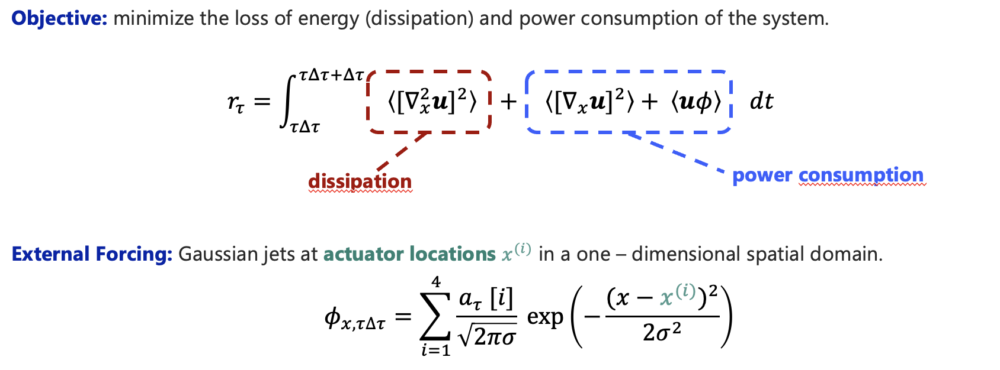
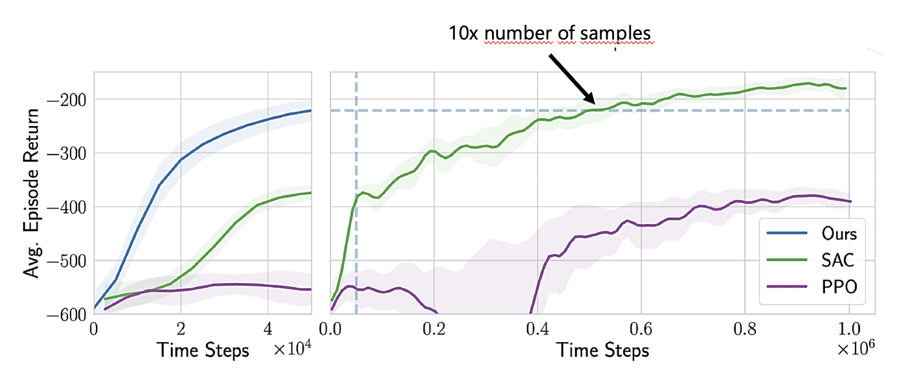
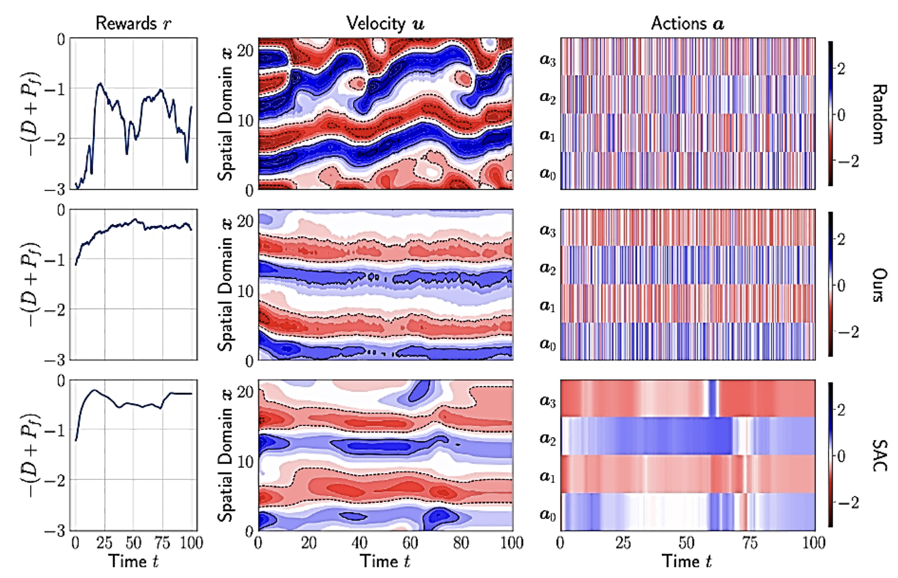

# Numerical Evidence for Sample Efficiency of Model-Based over Model-Free Reinforcement Learning Control of Partial Differential Equations [ECC'24]
[](https://github.com/stwerner97/pdecontrol/actions/workflows/python-app.yml) [](https://github.com/psf/black)

This repository holds the implementation of our model-based deep reinforcement learning algorithm for the control of partial differential equations (specifically the Kuramoto-Sivashinsky & Burger equations). This work has been presented at the European Control Conference

## Controlling the Kuramoto Sivashinsky Equation

Our work aims to minimize the dissipation and power consumption of a system whose dynamics are governed by the Kuramoto-Sivashinsky equation. An example of the system and its rewards where a controller applies random actions to it is illustrated below.


The reward is an integral of the system's dissipation and power consumption throughout the duration of a control period (fixed time intervals) in which the actuation signals are constant. The controller manipulates the scaling coefficients of Gaussian jets located in the one-dimensional spatial domain.




## Results & Evaluation

After 50,000 steps, our model-based control algorithm learns a control strategy that is on par with the most competitive model-free strategy after observing ~10x the number of samples, although the soft actor-critic agent eventually converges to a soution that better damps the dissipation of the system.



Both our model-based agent as well as the model-free soft actor-critic baseline are able to stabilize the system out of the chaotic transient.



## Setup
The dependencies can either be installed using the provided ``Dockerfile`` or using the ``pyproject.toml`` file (i.e. ``poetry install .``). Our implementation logs intermediate evaluation results to ``Weights & Biases``, so an API key must be provided to execute the optimization script.

## Reproduce Our Results
The ``pdecontrol/mbrl/script.py`` file serves as an entrypoint to running experiments for our control algorithm. You can use the script to 1) specify the configuration of the agent to be used, 2) adjust its training strategy & curriculum, and 3) specify the control problem it is applied to.

````python
python pdecontrol/mbrl/script.py
    --project <your wandb project>
    --name <your wandb run>
    --env_id KuramotoSivashinskyEnv-v0
    --factory <name of dynamics model registered in pdecontrol/architectures/__init__.py>
    --training "{\"tau\": 5, \"initial\": {\"tbtt\": 10, \"patience\": 10, \"batch_size\": 64}, \"iterations\": {\"tbtt\": 10, \"patience\": 5, \"batch_size\": 64}}"
    --trainer "{\"initial\": {\"min_steps\":250, \"max_steps\": 2000}, \"iterations\": {\"min_steps\":50, \"max_steps\": 250}}"
    --curriculum "{\"scheduler\": \"LinearScheduler\", \"steptype\": \"iteration\", \"start\": 0, \"stop\": 10, \"vmin\": 15, \"vmax\": 15}"
    --loss MSELoss
    --learning_starts 5000
    --rollout_length_schedule "{\"scheduler\": \"LinearScheduler\", \"steptype\": \"iteration\", \"start\": 0, \"stop\": 200, \"vmin\": 3, \"vmax\": 7}" --policy_train_steps_per_sample 10
    --surrogate_train_freq 500
````


# Citation

If you our code for ``model-based-pde-control`` in your work, please cite our paper:

`````
@inproceedings{werner2024numerical,
  title={Numerical Evidence for Sample Efficiency of Model-Based Over Model-Free Reinforcement Learning Control of Partial Differential Equations},
  author={Werner, Stefan and Peitz, Sebastian},
  booktitle={2024 European Control Conference (ECC)},
  pages={2965--2971},
  year={2024},
  organization={IEEE}
}
`````